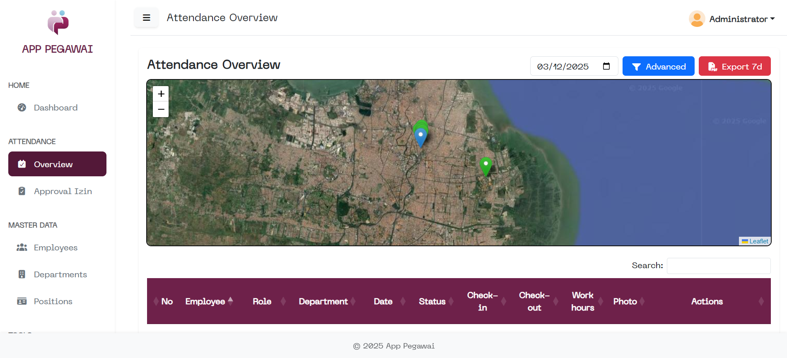

---

# APP-PEGAWAI

*Employee Management & Attendance System*



**APP-PEGAWAI** adalah aplikasi manajemen kepegawaian modern berbasis **Laravel 12**, dirancang untuk mengelola proses absensi berbasis **kamera + GPS**, pengelolaan data pegawai, slip gaji, serta pengumuman internal secara terpusat. Aplikasi ini menyediakan alur kerja yang efisien untuk dua role utama — **Admin** sebagai pengelola penuh sistem, dan **Karyawan** sebagai pengguna yang melakukan absensi dan melihat data terkait. Dengan dukungan **Vite**, **Bootstrap**, dan **AJAX**, aplikasi ini menyajikan pengalaman yang cepat, interaktif, dan mudah digunakan.

---

## 🚀 Fitur Utama

### **Absensi (Camera + Location)**

* Foto langsung via kamera device
* Validasi lokasi menggunakan GPS
* Riwayat cek-in & cek-out

### **Slip Gaji**

* Perhitungan otomatis berdasarkan posisi
* Tunjangan, potongan, dan alpha
* Unduh slip gaji dalam format PDF

### **Master Data**

* Department
* Position
* Employee

### **Announcement**

* Dibuat oleh admin
* Ditampilkan ke seluruh karyawan
* Pengiriman menggunakan AJAX

### **Dashboard Admin**

* Grafik statistik kehadiran
* Ringkasan data pegawai
* Rekap harian absensi

### **Role System**

* **Admin:** Full management & monitoring
* **Karyawan:** Absensi & akses data pribadi

---

## 🛠️ Teknologi Utama

* **Laravel 12**
* **MySQL**
* **Bootstrap 5**
* **Vite** (asset bundler)
* **jQuery + AJAX**
* **Blade Templates**

---

## 📦 Instalasi

```bash
git clone https://github.com/irvankurniawan624/APP-PEGAWAI.git
cd APP-PEGAWAI
composer install
cp .env.example .env
php artisan key:generate
php artisan migrate --seed
npm install
npm run build
php artisan serve
```

---

## 👤 Default Account

| Role     | Email                                     | Password |
| -------- | ----------------------------------------- | -------- |
| Admin    | [admin@gmail.com](mailto:admin@gmail.com) | admin    |
| Karyawan | [user@gmail.com](mailto:user@gmail.com)   | karyawan |

---